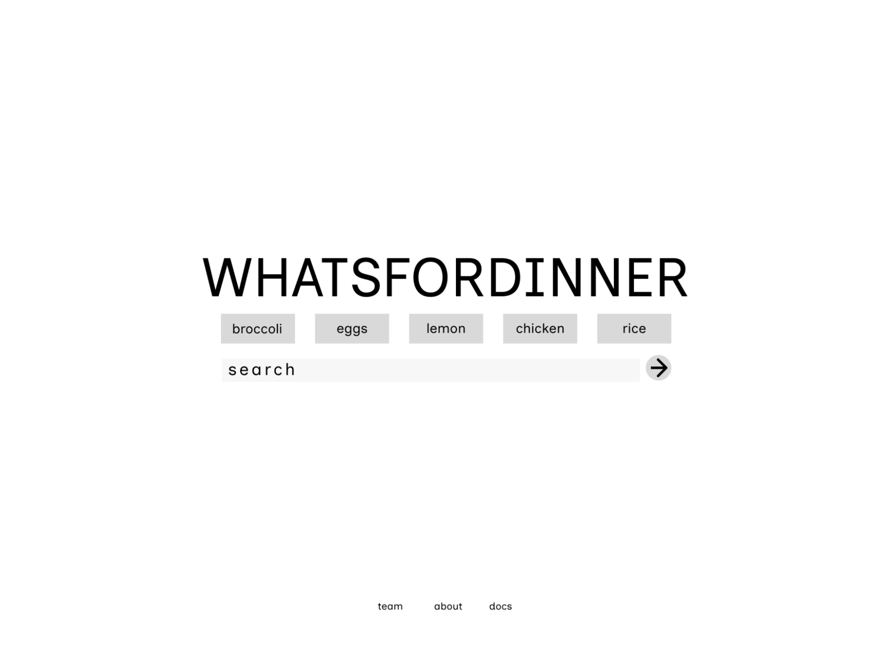
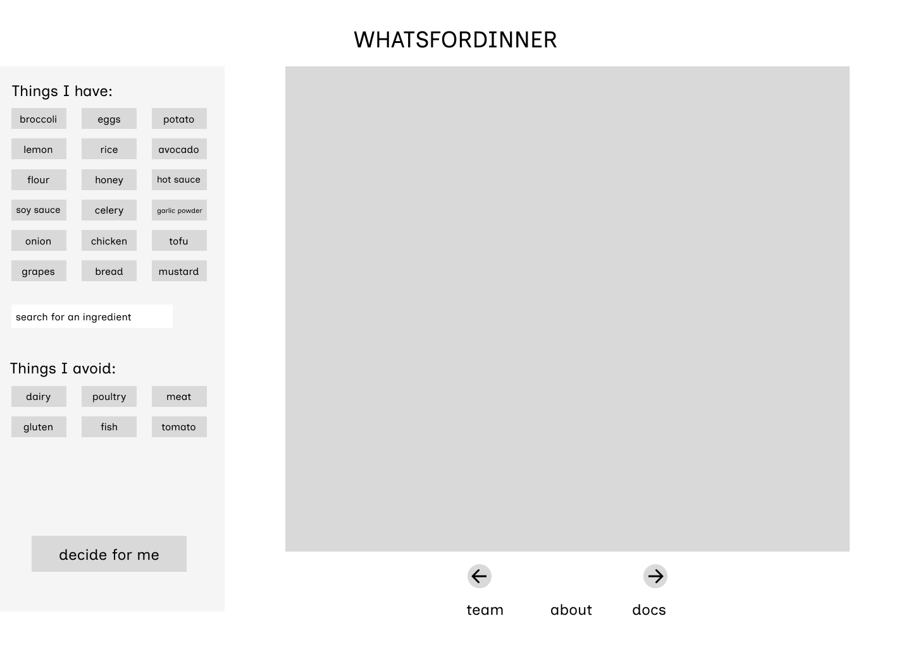
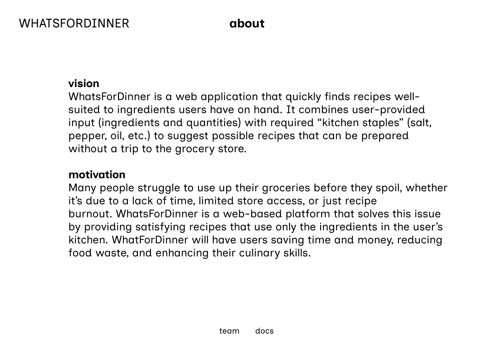
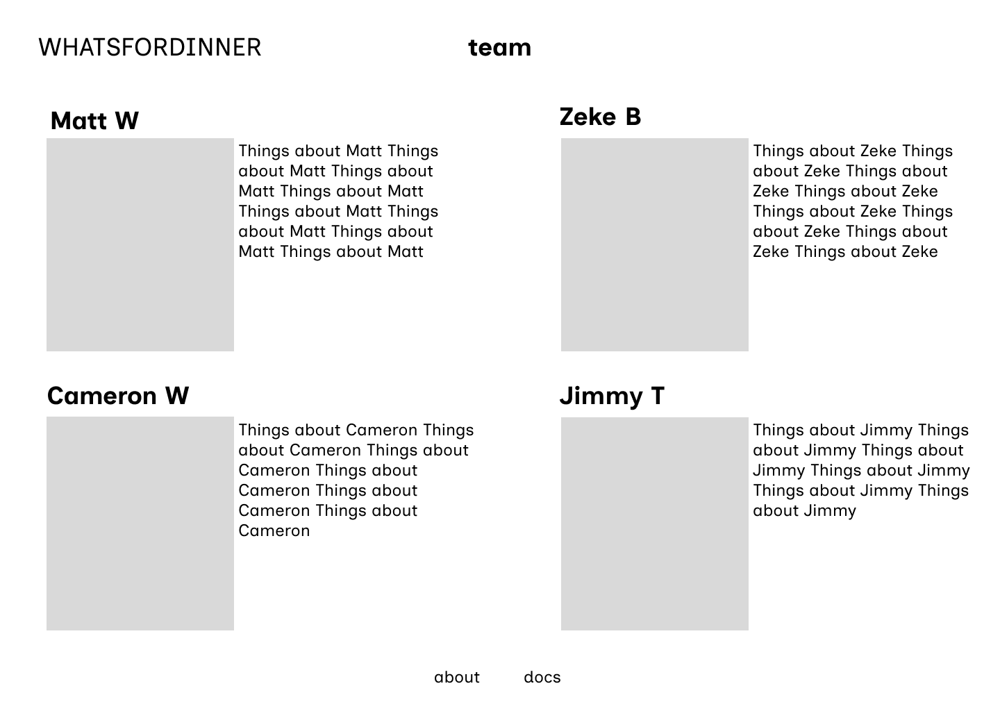
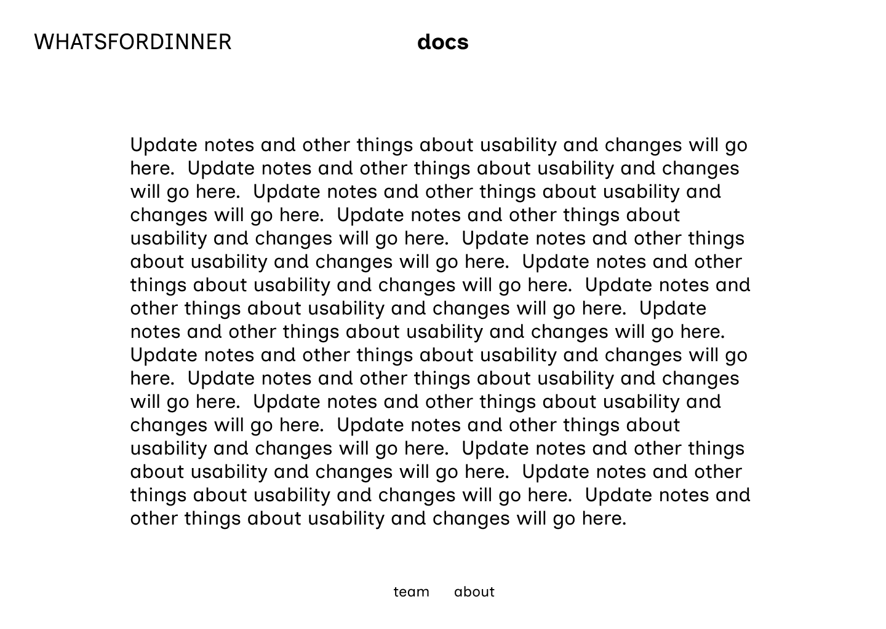

# WhatsForDinner Page Testing

This document defines the **pages** WhatsForDinner will implement and what is required to (1) render them correctly and (2) test them consistently.

---

## Conventions Used in This Document
- *wfd-result* is the resulting object in Python produced by the query
  - Will be a simple dictionary with the results of the query
- *wfd-bin* is the object Flask/Python holds to store user selection.
  - A list item or a dictionary with one key-value pair (which might be easier for json)
- Static site data will not be included as ‘data needed’ is only dynamically generated data.

## Not included in this Page Testing Document:
- Team member photos
- Style sheets
- Any variable that can safely be stored within a page.

## General testing
- Non-API endpoints load with trailing slash (‘.html/’)

# 1) wfd

## Page Title
WhatsForDinner - Home

## Description
Purpose: Present the WhatsForDinner tool and allow users to search for and select owned ingredients. Bring users to the Active tool page once an owned ingredient has been selected. Enable users to find other pages if seeking information related to project development.

## Mockup (wireframe)

## Parameters Needed for the Page
- Route parameters: None
- Query parameters: None

## Data Needed to Render the Page
- None

## Routes
- Either AWS server IP (http://3.142.114.125) or a TBD rented domain.
- @app.route(‘/wfd_search’, methods=[‘POST’])

## Tests
- Rendering: For both web and mobile web
  - All UI elements load
  - UI elements are placed properly on the page consistent to wireframe mockups
  - UI elements move and scale appropriately when window scales (web)
- Functionality
  - Links correctly redirect to other pages
  - UI elements properly react to hover, click, drag (if needed).
  - Buttons
    - Buttons can be selected, which results in a change in color for the button and selection in wfd-bin
    - Buttons can be deselected, which results in a change in color for the button and removal from wfd-bin
  - Search
    - Reacts to hover
    - Expands on text entry
    - Autocomplete via online tool (yet to be selected)
    - Search selection add/remove items from wfd-bin
  - Submission
    - Page initiates query function and redirects to Active tool page.
    - Active tool page receives query parameters after redirection from Home.

## Link destinations
- ‘https://mattwermers.github.io/WhatsForDinner/about.html’
- ‘https://mattwermers.github.io/WhatsForDinner/docs.html’
- ‘https://mattwermers.github.io/index.html/’
- ‘POST http://<aws ip or domain>/wfd_search.html’

---

# 2) wfd_search

## Page Title
WhatsForDinner - Active

## Page Description
Purpose: Display the results of the tool and allow the user to edit the filters of their search.  
Features: Present one recipe option at a time that can be completed from users’ selected owned ingredients. Enable users to cycle with the left or right arrows through recipes that fit the owned ingredients. Allow users to select or remove ingredients from their list of owned ingredients via a sidebar. Allow users to search for ingredients to add to their list of owned ingredients. Allow users to deselect ingredients from their list of owned ingredients. Allow users to select ingredients to exclude from search results. Include links to Team, About, and Docs pages.

## Mockup (wireframe)

### Parameters Needed for the Page
- Route parameters: 
  - ‘POST http://<aws ip or domain>/wfd_search.html’
- Query parameters:
  - Running JSON object with list of selected ingredients.

## Data Needed to Render the Page
- API data
  - SQLite image of RecipeNLG database

## Routes
- Either AWS server IP (http://3.142.114.125) or a TBD rented domain.
  - ‘/wfd_search.html’

## Tests for Verifying Rendering and Functionality of the Page
- Rendering: For both web and mobile web
  - All UI elements load
  - UI elements are placed properly on the page consistent to wireframe mockups
  - UI elements move and scale appropriately when window scales (web)
- Functionality
  - Links correctly redirect
  - UI elements properly react to hover, click, drag (if needed)
  - Buttons
    - Buttons can be selected, change color, and selection to wfd-bin
    - Buttons can be deselected, change color, and remove selection from wfd-bin
    - Left arrow correctly returns to previously viewed recipe
    - Right arrow views next recipe
      - Correctly with regard to any updates to ingredient list.
  - Search
    - Reacts to hover
    - Expands on text entry
    - Autocomplete via online tool (yet to be selected)
      - Autocomplete does not include already selected ingredients (if available through api)
    - Search item selection adds/removes items from wfd-bin
  - Submission
    - Upon user updating query, the next recipe selection does include updated query parameters.
  - Database
    - Database can be queried and returns appropriate results.

### Links
- ‘https://mattwermers.github.io/WhatsForDinner/about.html’
- ‘https://mattwermers.github.io/WhatsForDinner/docs.html’
- ‘https://mattwermers.github.io/index.html/’
- ‘GET http://<aws ip or domain>/wfd_search.html’

---

# 3) About WhatsForDinner

## Page Name
about

## Description:
Purpose: Inform users of the project usage and of the motivation behind the project. Include links to other project info pages and to the tool landing page.

## Mockup (wireframe)

## Parameters Needed for the Page
- Route parameters: None
- Query parameters: None

## Data Needed to Render the Page
None

## Tests for Verifying Rendering and Functionality of the Page
- Rendering: For both web and mobile web
    - All UI elements load
    - UI elements are placed properly on the page
    - UI elements move and scale appropriately when window scales (web)
- Functionality
    - Links correctly redirect
    -UI elements properly react to hover, click, drag (if needed).

## Parameters Needed for the Page
- Route ‘{{ site.baseurl }}/about.html’

## link destinations
- ‘{{ site.baseurl }}/team.html’
- ‘{{ site.baseurl}}/docs.html’
- Either aws server ip (http://3.142.114.125) or whatever domain I get (gonna rent one for my page anyway.

---

# 4) Team Information

## Page Title:
team

## Page Description
Purpose: Display photos and descriptions of team members. Detail team member contributions to WhatsForDinner and team member contact information.

## Mockup (wireframe)

## Parameters Needed for the Page
- Route parameters: None
- Query parameters: None

## Data Needed to Render the Page
None

## Tests for Verifying Rendering and Functionality of the Page
- Rendering: For both web and mobile web
    - All UI elements load
    - UI elements are placed properly on the page
    - UI elements move and scale appropriately when window scales (web)
- Functionality
    - Links correctly redirect
    - UI elements properly react to hover, click, drag (if needed).

## Parameters Needed for the Page
- Route ‘{{ site.baseurl }}/team.html’

## link destinations
- ‘{{ site.baseurl }}/about.html’
- ‘{{ site.baseurl}}/docs.html’
- Either aws server ip (http://3.142.114.125) or whatever domain I get (gonna rent one for my page anyway.

---

# 5) Project Documentation

## Page Title:
docs

## Page Description:
Purpose: Document project updates and resources. Link GitHub project repository. Credit sources such as RecipeNLG, cookbooks.com, whatthefuckshouldimakefordinner.com, and supercook.com.

## Mockup (Wireframe)

## Parameters Needed for the Page
- Route parameters: None
- Query parameters: None

## Data Needed to Render the Page
None

## tests

- Rendering: For both web and mobile web
    - All UI elements load
    - UI elements are placed properly on the page
    - UI elements move and scale appropriately when window scales (web)
-Functionality
    - Links correctly redirect
    - UI elements properly react to hover, click, drag (if needed).

## Parameters Needed for the Page

Route ‘{{ site.baseurl }}/docs.html’

## link destinations

- ‘{{ site.baseurl }}/about.html’
- ‘{{ site.baseurl}}/team.html’
- Either aws server ip (http://3.142.114.125) or whatever domain I get (gonna rent one for my page anyway.

---

## Notes for Implementation

Possibility of adding a user account feature to accommodate saving recipes, bookmarks, history, etc.
