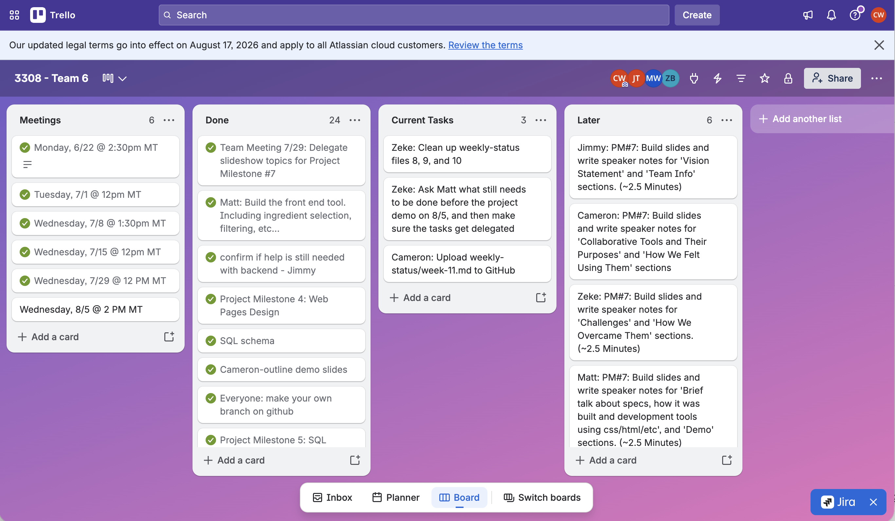

# Weekly Status: Week 11

**Project:** WhatsForDinner

**Team Number:** 6

**Team Name:** Team 6

---

## Reporting Period

**Week:** 11

**Meeting Held:** Yes

**Meeting Date:** 2026-07-29

**Meeting Duration:** 26 Minutes

**Meeting Format:** Google Meet

---

## Project Management Snapshot

Our team uses Trello for project tracking and management. Each team member is responsible for adding their tasks to the appropriate lists: **Meetings**, **Today**, **This Week**, **Later**, and **Done**. As the project progresses, the team may begin using Trello's built-in visual features to prioritize tasks.

Trello is updated after each weekly meeting to reflect newly assigned work. During each meeting, the Scrum Master completes the `WEEKLY_STATUS` file using the GitHub template. After reviewing the document, the Scrum Master is responsible for committing and pushing it to the project repository.

---

## Progress Summary Since Last Week

[Progress]

---

## Completed Tasks

* **Matt**
  * Individual interview (Milestone 6).
  * Reorganization of project repository.
* **Zeke**
  * Individual interview (Milestone 6).
  * Reorganization of project repository.
* **Cameron**
  * Basic outline for the demo slides.
  * Individual interview (Milestone 6).
* **Jimmy**
  * Individual interview (Milestone 6).

---

## Additional Notes:

[Notes]

---

## Planned Tasks

* Assign section(s) of demo presentation to each group member.
* Status check of app (Matt?).
* Jimmy's idea: using the text from the project proposal document to flesh out the powerpoint; Matt would cover the tech stack and demo.
* Keeping this brief–10-12 minutes total.
* Cameron: collaborative tools.
* Zeke: challenges/solutions.
* Jimmy: intro/problem/vision.
* Matt: specs/development tools + demo?
* Tech should be a high-level discussion; NO code on screen.
* Everyone responsible for own slides; put planned talking points into the speaker notes section on the shared slides doc (avoiding redundancy).
* Project demo recording next Wednesday (due Thursday); meeting at 2pm MT.
    * Can re-record on Thursday if needed.

---

## Document Status
Have all tasks been added to Trello after meeting?  
Yes

This document will be pushed to the project repository by:  
Cameron
